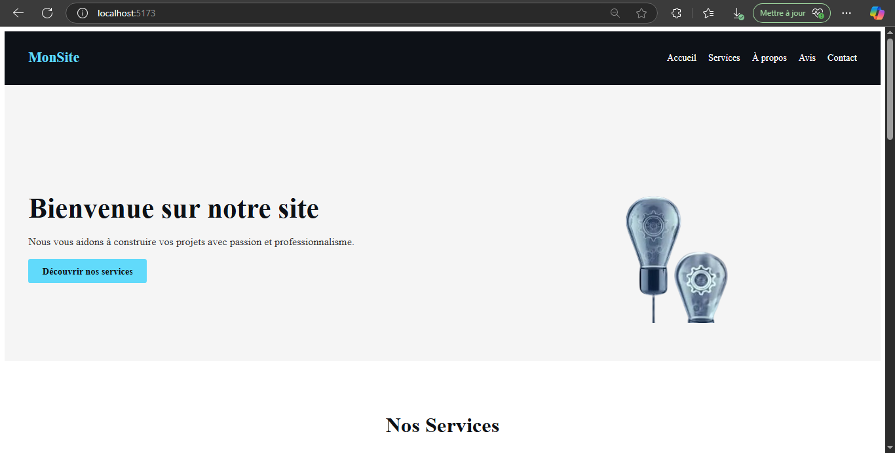

# React + Vite

# 🚀 Landing Page ReactJS - Premier Projet

Bienvenue sur mon tout premier projet en **ReactJS** !  
Ce projet a été réalisé dans le cadre de mon apprentissage du développement frontend, étape par étape, avec pour objectif de maîtriser les **bases de React**, sans framework de style (comme Tailwind ou Bootstrap), uniquement en **CSS classique**.

---

## 👤 Auteur

**Sylvanius Rosebéri**  
Développeur débutant passionné par le web et l’intelligence artificielle.  
Ce projet marque mes **premiers pas avec ReactJS**.

---

## 🎯 Objectifs du projet

- Comprendre la structure d’un projet React avec Vite
- Apprendre les **composants**, les **props**, et le **hook useState**
- Utiliser **CSS pur** pour structurer et styliser chaque section
- Appliquer les bonnes pratiques de **responsive design**
- Créer une page d’accueil **complète et fonctionnelle**

---

## 🧱 Structure de la landing page

La page comprend les sections suivantes :

- `Header` : menu de navigation sticky
- `Hero` : image d'accroche + call to action
- `Services` : composants dynamiques avec props
- `About` : texte + image en flex layout
- `Feedback` : cartes d'avis clients dynamiques
- `Contact` : formulaire avec gestion du state
- `Footer` : liens et copyright

---

## 💡 Remarque

👉 Le but de ce projet n’était **pas le design poussé** mais bien de comprendre les **fondamentaux de React**.  
Des améliorations esthétiques viendront plus tard au fil de mon apprentissage !

---

## 🛠️ Technologies utilisées

- ReactJS (avec Vite)
- JavaScript ES6
- CSS pur (modulaire, un fichier par composant)
- HTML sémantique

---

## ✅ Fonctionnalités de base

- Navigation interne fluide
- Composants modulaires et réutilisables
- Formulaire fonctionnel avec gestion du `state`
- Mise en page responsive sur mobile

---

## 📷 Aperçu 



---

## 📦 Installation

```bash
# Cloner le repo
git clone https://github.com/sylvanix/first-react-project.git

# Aller dans le dossier
cd first-react-project

# Installer les dépendances
npm install

# Lancer le serveur de développement
npm run dev

